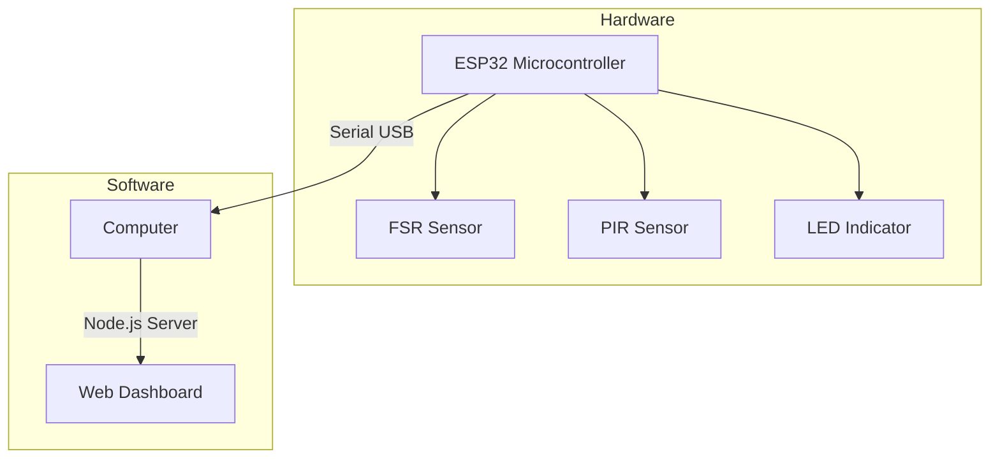

```mermaid
graph TD
    A[ESP32 Microcontroller] -->|Serial USB| B[Computer]
    B -->|Node.js Server| C[Web Dashboard]
    A --> D[FSR Sensor]
    A --> E[PIR Sensor]
    A --> F[LED Indicator]
    
    subgraph Hardware
        A
        D
        E
        F
    end
    
    subgraph Software
        B
        C
    end
```